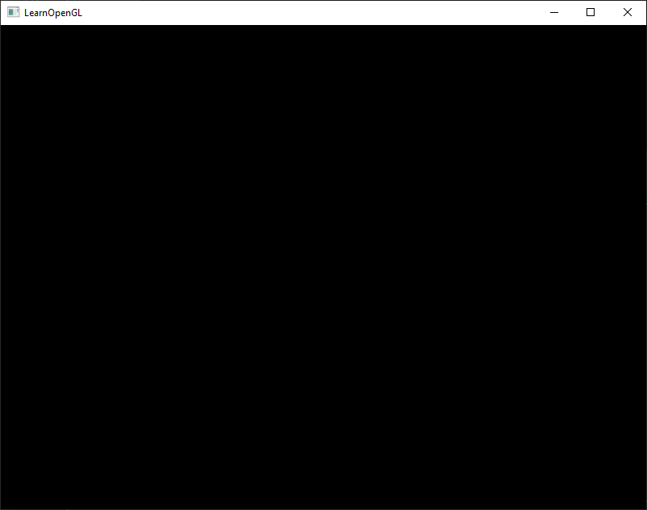
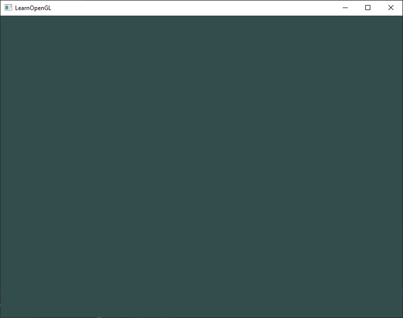

# [02. Hello Window](https://learnopengl.com/Getting-started/Hello-Window)

이제 GLFW를 실행할 수 있는지 확인해 봅시다.
먼저, `.cpp` 파일을 하나 생성한 뒤, 파일 상단에 다음과 같은 헤더 파일들을 추가해 주세요.

```CPP
#include <glad/glad.h>
#include <GLFW/glfw3.h>
```

> 여기서 중요한 점은, GLFW보다 먼저 GLAD를 include 해야 한다는 것입니다.
GLAD의 include 파일은 내부적으로 필수 OpenGL 헤더 파일들(예: GL/gl.h)을 포함하고 있기 때문에,
OpenGL 헤더를 필요로 하는 다른 헤더 파일들(예: GLFW)보다 먼저 GLAD를 include 해야 합니다.

그 다음으로, 메인 함수를 생성해서 그 안에서 GLFW 윈도우를 생성해 보겠습니다.

```CPP
int main()
{
    glfwInit();
    glfwWindowHint(GLFW_CONTEXT_VERSION_MAJOR, 3);
    glfwWindowHint(GLFW_CONTEXT_VERSION_MINOR, 3);
    glfwWindowHint(GLFW_OPENGL_PROFILE, GLFW_OPENGL_CORE_PROFILE);
    //glfwWindowHint(GLFW_OPENGL_FORWARD_COMPAT, GL_TRUE);
  
    return 0;
}
```

메인 함수에서 우리는 먼저 `glfwInit`으로 GLFW를 초기화한 다음, `glfwWindowHint`을 사용해 GLFW를 설정할 수 있습니다. `glfwWindowHint`의 첫 번째 인자는 어떤 옵션을 설정할지 알려주며, 가능한 옵션들은 모두 GLFW_ 접두사가 붙은 큰 열거형(enum)에서 선택할 수 있습니다. 두 번째 인자는 해당 옵션의 값을 설정하는 정수입니다. 사용 가능한 모든 옵션과 그에 대응하는 값들은 [GLFW의 윈도우 처리 문서](https://www.glfw.org/docs/latest/window.html#window_hints)에서 확인할 수 있습니다. 만약 지금 애플리케이션을 실행했을 때 많은 undefined reference 오류가 발생한다면, 이는 GLFW 라이브러리를 성공적으로 링크하지 못했기 때문입니다.

이 책의 초점은 OpenGL 3.3 버전이기 때문에, 우리는 GLFW에게 우리가 사용할 OpenGL 버전이 3.3임을 알려주고 싶습니다. 이렇게 하면 GLFW가 OpenGL 컨텍스트를 생성할 때 적절한 설정을 할 수 있습니다. 이는 사용자가 적절한 OpenGL 버전을 가지고 있지 않을 경우 GLFW가 실행되지 않도록 보장합니다. 우리는 주 버전과 부 버전을 모두 3으로 설정합니다. 또한 우리는 GLFW에게 명시적으로 core-profile을 사용하겠다고 알려줍니다. GLFW에게 core-profile을 사용하겠다고 알려주는 것은, 이전 버전과의 호환 기능을 제외한 더 작은 하위 집합의 OpenGL 기능을 사용하겠다는 의미입니다. Mac OS X에서는 초기화 코드에 다음 줄을 추가해야 작동합니다: `glfwWindowHint(GLFW_OPENGL_FORWARD_COMPAT, GL_TRUE);`

> 시스템이나 하드웨어에 OpenGL 3.3 버전 이상이 설치되어 있는지 반드시 확인하세요. 그렇지 않으면 애플리케이션이 크래시(충돌)하거나 예기치 않은 동작을 보일 수 있습니다.
자신의 머신에서 OpenGL 버전을 확인하려면, Linux에서는 glxinfo 명령어를 사용하거나, Windows에서는 OpenGL Extension Viewer와 같은 유틸리티 프로그램을 사용하세요.
만약 지원되는 버전이 낮다면, 비디오 카드가 OpenGL 3.3 이상을 지원하는지 확인해보고
(그렇지 않다면 매우 오래된 카드일 가능성이 큽니다)
또는 그래픽 드라이버를 업데이트해 보세요.

다음으로, 우리는 윈도우 객체를 생성해야 합니다.
이 윈도우 객체는 모든 윈도우 관련 데이터를 포함하고 있으며,
GLFW의 대부분 다른 함수들에서 필수적으로 요구됩니다.

```CPP
GLFWwindow* window = glfwCreateWindow(800, 600, "LearnOpenGL", NULL, NULL);
if (window == NULL)
{
    std::cout << "Failed to create GLFW window" << std::endl;
    glfwTerminate();
    return -1;
}
glfwMakeContextCurrent(window);
```

`glfwCreateWindow` 함수는 첫 번째와 두 번째 인자로 각각 윈도우의 너비와 높이를 요구합니다.
세 번째 인자는 윈도우의 이름을 지정할 수 있으며, 여기서는 "LearnOpenGL"로 설정하지만 원하는 이름으로 바꿀 수 있습니다.
마지막 두 개의 인자는 무시해도 됩니다.
이 함수는 이후 다른 GLFW 작업에 필요하게 될 GLFWwindow 객체를 반환합니다.
그 다음으로, 우리는 현재 스레드에서 해당 윈도우의 컨텍스트를 주요 컨텍스트로 설정하도록 GLFW에 지시합니다.

## GLAD

이전 챕터에서 우리는 GLAD가 OpenGL의 함수 포인터들을 관리한다고 언급했습니다.
따라서 OpenGL 함수를 호출하기 전에 반드시 GLAD를 초기화해야 합니다.

```CPP
if (!gladLoadGLLoader((GLADloadproc)glfwGetProcAddress))
{
    std::cout << "Failed to initialize GLAD" << std::endl;
    return -1;
}    
```

우리는 GLAD에 OpenGL 함수 포인터들의 주소를 로드하는 함수를 전달합니다.
이 함수는 운영 체제에 따라 다르며,
GLFW는 이를 위해 `glfwGetProcAddress` 함수를 제공하여
우리가 어떤 OS에서 컴파일하고 있는지에 따라 올바른 함수 주소를 반환합니다.

## Viewport

렌더링을 시작하기 전에 마지막으로 해야 할 작업이 하나 있습니다.
OpenGL에게 렌더링 윈도우의 크기를 알려주어야 합니다.
그래야 OpenGL은 데이터와 좌표를 윈도우 크기에 맞춰 어떻게 표시할지 알 수 있습니다.
이 크기는 `glViewport` 함수를 통해 설정할 수 있습니다.

```CPP
glViewport(0, 0, 800, 600);
```

glViewport의 첫 번째와 두 번째 인자는 윈도우 내에서 왼쪽 아래 모서리의 위치를 설정합니다.
세 번째와 네 번째 인자는 렌더링 윈도우의 **가로와 세로 크기(픽셀 단위)**를 설정하며,
일반적으로 GLFW 윈도우의 크기와 동일하게 설정합니다.

사실 우리는 뷰포트 크기를 GLFW 윈도우 크기보다 작게 설정할 수도 있습니다.
그렇게 하면 모든 OpenGL 렌더링이 더 작은 영역에 표시되고,
예를 들어 뷰포트 바깥쪽에 다른 요소들을 표시할 수도 있습니다.

> 내부적으로 OpenGL은 glViewport로 지정한 데이터를 사용해
처리된 2D 좌표를 화면 상의 좌표로 변환합니다.
예를 들어, 처리된 좌표가 (-0.5, 0.5)라면
최종적으로는 화면 좌표 (200, 450)으로 변환될 수 있습니다.
OpenGL에서 처리된 좌표는 항상 -1에서 1 사이이므로,
결국 (-1, 1) 범위를 (0, 800)과 (0, 600) 범위로 매핑하게 됩니다.

그러나 사용자가 윈도우 크기를 조절하는 순간, 뷰포트 역시 그에 맞게 조정되어야 합니다.
이를 위해 우리는 윈도우에 **콜백 함수(callback function)**를 등록할 수 있으며,
윈도우 크기가 변경될 때마다 이 콜백 함수가 호출됩니다.
이 리사이즈 콜백 함수는 다음과 같은 프로토타입을 가집니다:

```CPP
void framebuffer_size_callback(GLFWwindow* window, int width, int height);  
```

프레임버퍼 크기 함수는 첫 번째 인자로 `GLFWwindow` 객체를 받고,
두 번째와 세 번째 인자로 새로운 윈도우의 가로와 세로 크기를 받습니다.
윈도우 크기가 변경될 때마다, GLFW는 이 함수를 호출하고
올바른 인자 값들을 채워 넣어 전달합니다.

```CPP
void framebuffer_size_callback(GLFWwindow* window, int width, int height)
{
    glViewport(0, 0, width, height);
}  
```

우리는 GLFW에게 윈도우 크기 변경 시 이 함수가 호출되도록 등록해 주어야 합니다:

```CPP
glfwSetFramebufferSizeCallback(window, framebuffer_size_callback);  
```

윈도우가 처음 표시될 때에도,
`framebuffer_size_callback`은 최초의 윈도우 크기를 가지고 호출됩니다.
Retina 디스플레이에서는 가로와 세로 크기가
초기 입력 값보다 훨씬 더 크게 전달될 수 있습니다.

우리가 등록할 수 있는 콜백 함수는 이 외에도 많습니다.
예를 들어, 조이스틱 입력 변경을 처리하거나,
에러 메시지를 처리하는 콜백 함수를 만들 수도 있습니다.
이러한 콜백 함수들은 일반적으로 윈도우를 생성한 이후,
렌더 루프를 시작하기 전에 등록합니다.

## Ready your engines

우리는 애플리케이션이 단 한 번 이미지를 그린 뒤 즉시 종료되고 윈도우가 닫히는 것을 원하지 않습니다.
대신, 프로그램이 명시적으로 종료 명령을 받을 때까지 계속해서 이미지를 그리고, 사용자 입력을 처리하기를 원합니다.
이를 위해 우리는 while 루프, 즉 **렌더 루프(render loop)**를 만들어야 하며,
이 루프는 우리가 GLFW에게 종료하라고 지시할 때까지 계속 실행됩니다.
다음 코드는 매우 간단한 렌더 루프의 예시입니다:

```CPP
while(!glfwWindowShouldClose(window))
{
    glfwSwapBuffers(window);
    glfwPollEvents();    
}
```

`glfwWindowShouldClose` 함수는 루프의 각 반복 시작 시
GLFW가 종료 지시를 받았는지 확인합니다.
종료 지시가 내려졌다면, 이 함수는 true를 반환하고
렌더 루프는 중단됩니다.
그 이후 우리는 애플리케이션을 종료할 수 있습니다.

`glfwPollEvents` 함수는 키보드 입력, 마우스 이동 이벤트 등
트리거된 이벤트가 있는지 확인하고,
윈도우 상태를 업데이트하며,
등록된 콜백 함수들을 호출합니다.
glfwSwapBuffers는 **컬러 버퍼(color buffer)**를 교체합니다.
컬러 버퍼는 GLFW 윈도우의 각 픽셀에 대한 색상 값을 포함하는
2D 버퍼이며, 렌더 루프의 현재 반복 동안 사용됩니다.
버퍼를 교체하면 렌더링된 이미지를 화면에 출력할 수 있습니다.

> 더블 버퍼 (Double Buffer)  
애플리케이션이 **단일 버퍼(single buffer)**에서 그리기를 수행하면,
결과 이미지에서 깜빡임(flickering) 문제가 발생할 수 있습니다.
이는 최종 출력 이미지가 한 번에 그려지는 것이 아니라,
픽셀 단위로 왼쪽에서 오른쪽, 위에서 아래로 순차적으로 그려지기 때문입니다.
렌더링 도중 아직 완성되지 않은 이미지가 사용자에게 표시되면,
화면에 깨진 이미지(artifact)가 나타날 수 있습니다.  
이러한 문제를 방지하기 위해,
윈도우 애플리케이션에서는 더블 버퍼(double buffer) 방식을 사용합니다.
**프론트 버퍼(front buffer)**에는 화면에 표시될 최종 출력 이미지가 담겨 있으며,
모든 렌더링 명령은 **백 버퍼(back buffer)**에 그려집니다.
모든 렌더링 작업이 완료되면,
**백 버퍼와 프론트 버퍼를 교체(swap)**하여
렌더링이 완료된 이미지가 화면에 표시됩니다.
이로 인해 앞서 언급한 아티팩트(artifact) 문제를 방지할 수 있습니다.

## One last thing

렌더 루프를 빠져나오면,
우리는 GLFW에서 할당된 모든 리소스를 정리하고 삭제해 주어야 합니다.
이를 위해 메인 함수의 마지막에 `glfwTerminate` 함수를 호출하면 됩니다.

```CPP
glfwTerminate();
return 0;
```

이 함수는 모든 리소스를 정리하고
애플리케이션을 올바르게 종료시켜줍니다.
이제 애플리케이션을 컴파일해 보세요.
모든 과정이 잘 진행되었다면,
다음과 같은 출력 결과를 볼 수 있을 것입니다.



만약 매우 밋밋하고 지루한 검은 화면이 나타났다면,
그것은 정상적으로 작업이 완료된 것입니다!
만약 올바른 이미지가 나오지 않았거나,
전체 구조가 어떻게 연결되는지 혼란스럽다면
전체 소스 코드를 [여기](https://learnopengl.com/code_viewer_gh.php?code=src/1.getting_started/1.1.hello_window/hello_window.cpp)에서 확인해 보세요.
(그리고 만약 화면이 여러 색으로 깜빡이기 시작했다면, 계속 읽어 보세요.)

애플리케이션을 컴파일하는 데 문제가 있다면,
먼저 링커 옵션들이 올바르게 설정되었는지,
그리고 IDE에 필요한 디렉터리들이 제대로 포함되었는지 확인하세요
(이는 이전 챕터에서 설명했습니다).
또한 코드가 정확한지 다시 확인해 보세요.
전체 소스 코드와 비교하여 검증할 수 있습니다.

## Input

우리는 GLFW에서 입력 제어 기능도 사용하고 싶고,
이는 GLFW가 제공하는 여러 입력 함수들로 구현할 수 있습니다.
여기서는 `glfwGetKey` 함수를 사용할 것입니다.
이 함수는 윈도우와 키 값을 인자로 받아,
해당 키가 현재 눌려져 있는지 여부를 반환합니다.
우리는 모든 입력 코드를 정리하기 위해
`processInput`이라는 함수를 만들 것입니다.

```CPP
void processInput(GLFWwindow *window)
{
    if(glfwGetKey(window, GLFW_KEY_ESCAPE) == GLFW_PRESS)
        glfwSetWindowShouldClose(window, true);
}
```

여기에서는 사용자가 ESC 키를 눌렀는지 확인합니다
(눌리지 않았다면 `glfwGetKey`는 `GLFW_RELEASE`를 반환합니다).
만약 사용자가 ESC 키를 눌렀다면,
`glfwSetWindowShouldClose` 함수를 사용해
윈도우의 `WindowShouldClose` 속성을 true로 설정하여
GLFW를 종료하도록 합니다.
그러면 메인 while 루프의 다음 조건 확인에서 false가 되어 루프가 종료되고,
애플리케이션이 닫히게 됩니다.

그 다음, 우리는 **렌더 루프의 매 반복(iteration)**마다
processInput을 호출합니다:

```CPP
while (!glfwWindowShouldClose(window))
{
    processInput(window);

    glfwSwapBuffers(window);
    glfwPollEvents();
}  
```

이렇게 하면 특정 키 입력을 매 프레임마다 확인하고,
그에 따라 반응하는 간단한 방법을 가질 수 있습니다.
렌더 루프의 한 번의 반복은 흔히 **프레임(frame)**이라고 부릅니다.

## Rendering

우리는 렌더 루프의 각 반복 또는 프레임마다 모든 렌더링 명령을 실행하고 싶기 때문에, 모든 렌더링 명령을 렌더 루프 안에 배치하고자 합니다. 이것은 다음과 같은 모습일 것입니다:

```CPP
// render loop
while(!glfwWindowShouldClose(window))
{
    // input
    processInput(window);

    // rendering commands here
    ...

    // check and call events and swap the buffers
    glfwPollEvents();
    glfwSwapBuffers(window);
}
```

제대로 동작하는지 확인하기 위해, 우리는 화면을 원하는 색상으로 지워보고자 합니다. 프레임의 시작 시점에서 화면을 지우고 싶습니다. 그렇지 않으면 이전 프레임의 결과물이 여전히 보이게 됩니다 (이것이 원하는 효과일 수도 있지만, 보통은 그렇지 않습니다). 우리는 glClear 함수를 사용하여 화면의 색상 버퍼를 지울 수 있으며, 어떤 버퍼를 지울지 지정하기 위해 버퍼 비트를 전달합니다. 설정할 수 있는 비트는 GL_COLOR_BUFFER_BIT, GL_DEPTH_BUFFER_BIT, GL_STENCIL_BUFFER_BIT입니다. 현재는 색상 값만 신경 쓰므로 색상 버퍼만 지웁니다.

```CPP
glClearColor(0.2f, 0.3f, 0.3f, 1.0f);
glClear(GL_COLOR_BUFFER_BIT);
```

또한 우리는 `glClearColor`를 사용하여 화면을 지울 때 사용할 색상을 지정한다는 점에 주의하세요. glClear를 호출하고 색상 버퍼를 지우면, 색상 버퍼 전체가 `glClearColor`로 설정된 색상으로 채워집니다. 이는 어두운 녹청색 계열의 색상으로 나타날 것입니다.

OpenGL 챕터에서 언급했듯이, `glClearColor` 함수는 상태를 설정하는 함수이고, `glClear` 함수는 상태를 사용하는 함수입니다. `glClear`는 현재 상태에서 지울 색상을 가져와 사용합니다.



애플리케이션의 전체 소스 코드는 [여기](https://learnopengl.com/code_viewer_gh.php?code=src/1.getting_started/1.2.hello_window_clear/hello_window_clear.cpp)에서 확인할 수 있습니다.

이제 우리는 렌더 루프를 다양한 렌더링 호출들로 채울 준비가 모두 끝났습니다. 그러나 그것은 다음 장에서 다룰 내용입니다. 여기까지도 이미 충분히 많은 내용을 다루었습니다.